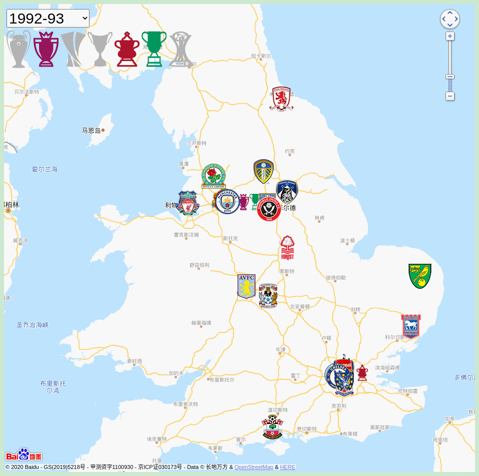

# Premier League Map




#### Introduction
From 1992 to this season, the Premier League teams and their home courts are mapped.

Click on the team icon to see the data of the Champions League, Europa League, Champions Cup, Premier League, FA Cup, Club World Cup.

Click on the trophy in the upper left corner to jump to the team.

Click on the team crest to see the historical honors as of the current season.

Data from the premier league website and Wikipedia.


#### Feature
- The team is positioned to the home court of the season
- Honors of the season
- To the last champion
- To the last league title of the season
- The number and year of each Championship
- Promotion and degration
- Derby opponents

#### How to use ?


#### Abbreviation 

| Abbr | Full Name                          |
| ---- | ---------------------------------- |
| UCL  | UEFA Champion League               |
| UEL  | UEFA Europa League                 |
| PL   | Premier League                     |
| FA   | Football Association Challenge Cup |
| EFL  | English Football League Cup        |
| APL  | Football League First Division     |
| CWC  | UEFA Cup Winners' Cup              |
| FCWC | FIFA Club World Cup                |


#### Project structure

```
├── csv/                  # origin csv file of js/ 
├── favicon.ico
├── screenshots/          # screenshots and gifs
├── img/
├── index.html
├── js/
├── locales/              # multi language support
├── map-style/            # map style. uesless for now
├── PLdata/               # every season Premier League data
├── README.md
└── README_zh.md
```


#### Run in localhost

```
python3 -m http.server
```
Or use other static HTTP server, such as nginx or [see](https://github.com/wyhaya/see)

#### Generate js from .csv file
```
cd csv
./b.py
```

#### Generate the gif in Readme.md
```
cd screenshots
convert -delay 120 -loop 0 *.png  out.gif
```

#### Contribution
This website is far from perfect. If I made some mistake or you have any advice, feel free to submit a issue.
