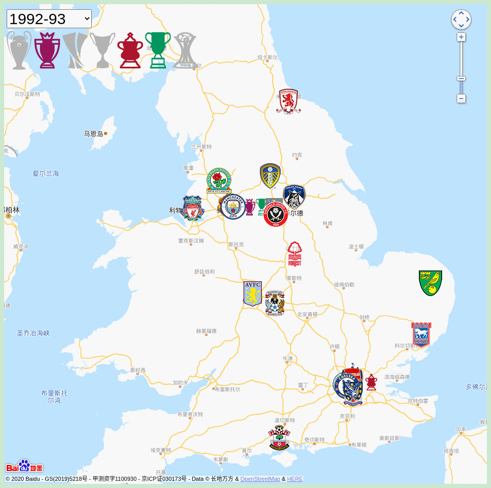
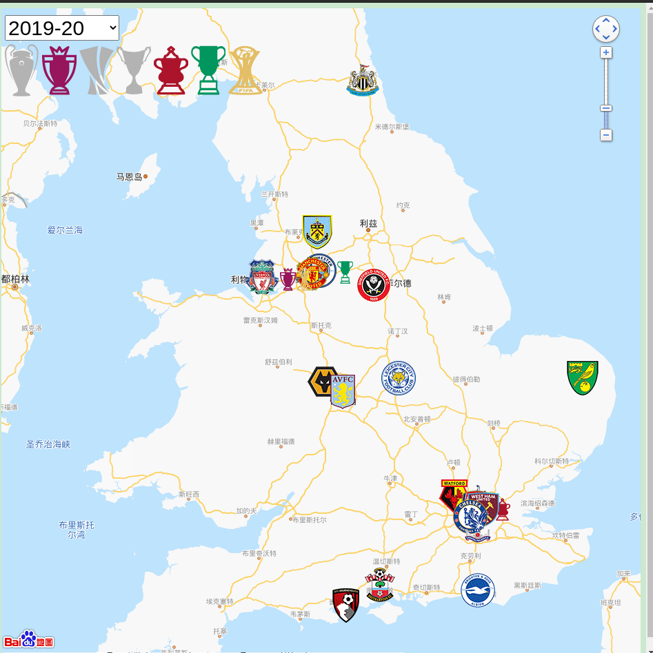

# 英超地图




#### 介绍
1992-2018 英超地图(联赛,欧冠,欧联,足总杯,联赛杯,世俱杯,优胜者杯)

#### Feature
- 球队定位到球队当赛季的主场
- 当赛季的荣誉
- 截至该赛季的最后一个冠军
- 截至该赛季的最后一个联赛冠军
- 欧战的夺冠次数和年份
- 升降级信息

#### How to use ?



#### 缩写解释
UCL UEFA Champion League

UEL UEFA Europa League

PL  Premier League

FA  Football Association Challenge Cup

EFL English Football League Cup

APL 老英甲

CWC UEFA Cup Winners' Cup

FCWC FIFA Club World Cup


#### 目录架构

```
├── csv                # origin data of js/
├── favicon.ico
├── img
├── index.html
├── js
├── locales            # multi language support
├── map-style          # map style. uesless for now
├── PLdata             # every season Premier League data
└── README.md
└── README.md
```


#### 安装教程

```
python3 -m http.server
```
Or use other static HTTP server, such as nginx or [see](https://github.com/wyhaya/see)

#### 更新数据
```
cd csv
./b.py

# generate the git in Readme
convert -delay 120 -loop 0 *.png  out.gif
```

