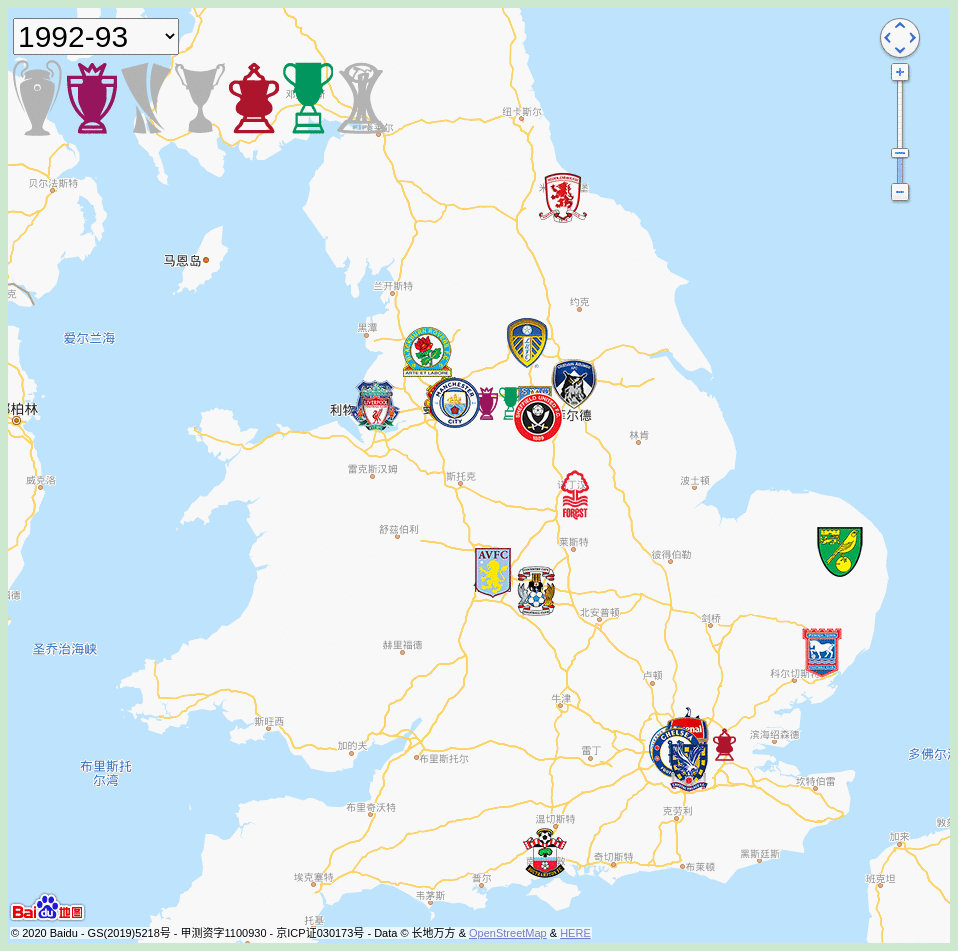

# 英超地图




#### 介绍
1992-2018 英超地图(联赛,欧冠,欧联,足总杯,联赛杯,世俱杯,优胜者杯)

#### Feature
- 球队定位到球队当赛季的主场
- 每一个赛季显示的数据,是截止到那个赛季的夺冠次数和夺冠年份
- 标注了升降级信息

#### How to use ?


#### 缩写解释
UCL 欧冠

UEL 欧联

PL  英超

FA  足总杯

EFL 联赛杯

APL 老英甲

CWC 优胜者杯

FCWC 世俱杯

#### 目录架构

```
├── csv 每一年,各项赛事的冠军
├── favicon.ico
├── img
├── index.html
├── js
├── locales 多语言支持
├── map-style 百度地图style,可以根据每年的冠军,更换地图配色,但是效果不太好
├── PLdata 每个赛季的联赛数据
└── README.md
```


#### 安装教程

```
python3 -m http.server
```
Or use other static HTTP server, such as nginx or [see](https://github.com/wyhaya/see)

#### 更新数据
```
cd csv
./process.sh

# generate the git in Readme
convert -delay 120 -loop 0 *.png  out.gif
```

