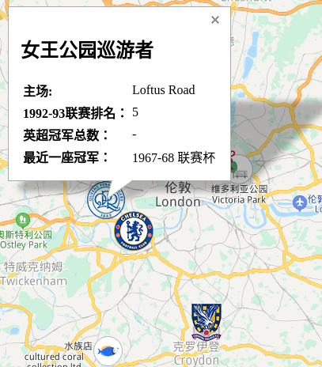

小时侯看中超,隔壁的阿姨会让我把每支球队在哪里在中国地图上标出来.国内的地图我就是这么熟悉的,没有球队的城市到现在都很陌生.长大以后看英超,由于不太熟悉英国地理,很多城市都不太容易找到.有时甚至分不清是城市名还是队名,比如埃弗顿,阿斯顿维拉.在前一阵在懂球帝上看到这样一张图:

于是萌生了也做一个英超地图的想法.我到处搜了一下,没找到这样的网站.有一些老图片,但是没有交互性,也找不全所有年份的.

于是我从英超官网和维基百科收集了数据,做了一个可视化.

___

做完地图后自己玩了一下,还是知道了一些新东西

比如埃弗顿和利物浦离的这么近,只隔了一座公园

泰恩河又这么远,难怪纽卡斯尔每年的客场距离都是最长的

东北角的三兄弟,上一次齐聚英超还是2008-09赛季.该赛季后,米德尔斯堡和纽卡斯尔都降级了.现在3支球队在3个级别.

水晶宫和布莱顿离的确实不远,难怪成为M23公路德比

南海岸德比 南安普顿对朴茨茅斯.上一次在英超出现是2004-05赛季

温布尔顿在伦敦南方.曾经和水晶宫在1992年共用主场.这似乎是英超1992年到现在唯一的共用主场现象.当年水晶宫降级.

伦敦的这些球队,实在找不到一个赛季是聚齐的,一个合影都拍不到.

1994-95赛季,英超从22支球队缩减到20支球队.升班马水晶宫不幸成为以倒数第4降级的球队.另外3支是伊普斯维奇,诺维奇和莱斯特城

西汉姆联拿过一座优胜者杯.在伦敦,切尔西,阿森纳,热刺都拿过

伊普斯维奇有一座欧联杯,耗尽了未来40年的运气.

1992英超元年,伦敦排名最高的球队是女王公园巡游者

唯一一支集齐国内三座奖杯的球队(右上角)

曼联的辉煌赛季

曼城的老主场缅因路球场已经拆除,现在是居民区

布莱克本(Blackburn Rover)和布莱克浦(BlackPool)是两支球队,我一直以为是不同的翻译.布莱克浦也被译成黑池.不过他们挺近的.布莱克浦只在2010-11赛季踢过英超,布莱克本在1994-95拿过队史唯一一座英超冠军.

布莱克本和伯恩利还是东兰开夏德比

  

又是两支容易搞混的球队:布伦德福德城和布伦德福德.布伦德福德城在西约克郡,在1999-2001年踢过两年英超.布伦德福德在西伦敦,从未踢过英超.

威尔士南部德比(卡迪夫和斯旺西)

### 现在还有些缺陷和想做的事:

1.  有些换过队徽的球队我还没有统计,队徽都是使用现在的
2.  欧洲优胜者杯不知道该用什么配色
3.  想过用当年冠军球队的配色,改地图的样式.不过效果不太好
4.  考虑做一下英冠的,因为英冠有好多熟悉的球队,整理一下会很有意思.也会考虑做西甲,德甲什么的
5.  整理每支球队的创立时间

  

